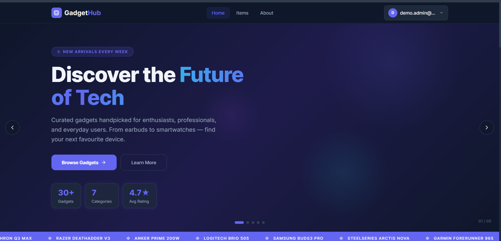
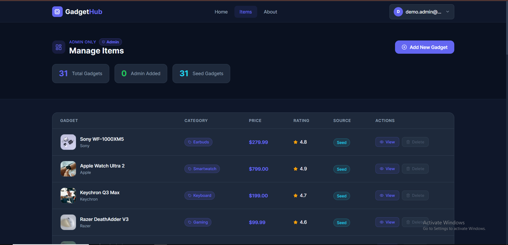
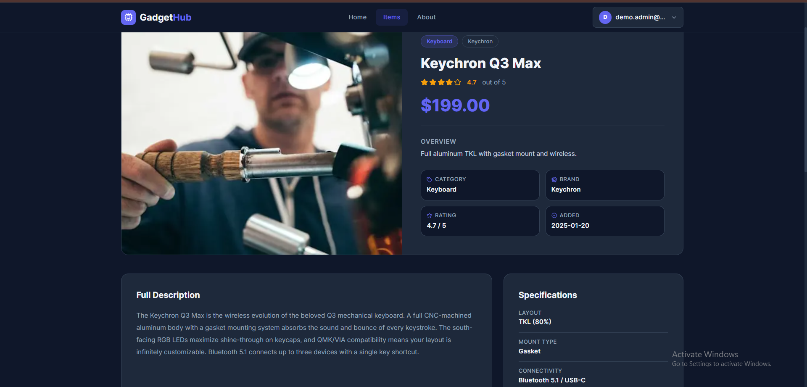

<div align="center">


</div>

<div align="center">

[](https://gadget-hub-delta.vercel.app)
[](https://github.com/Mushfiq599/gadgethub-client)
[](https://github.com/Mushfiq599/gadgethub-server)
[](https://nextjs.org)
[](https://mongodb.com)

</div>

---

## 📌 Project Overview

**GadgetHub** is a full-stack tech gadget showcase and marketplace platform where users can browse, review, and order gadgets. It features a complete role-based access system with separate dashboards for **Users** and **Admins**, Google OAuth login, a full cart and order flow, and a demo credentials panel for easy testing.

The project is built with **Next.js 15 App Router**, **Tailwind CSS v4**, and **Firebase Authentication** on the frontend, with a **Node.js/Express** REST API and **MongoDB** on the backend — fully deployed on **Vercel**.

---

## 🖼️ Screenshots

> **Homepage**


> **Admin Dashboard**


> **Product Details Page**


---

## ✨ Main Features

### 👤 User Features
- 🔐 Email/password and **Google OAuth** login via Firebase
- 🛒 Add to cart, update quantity, and place orders
- 📦 View personal order history and order status
- ⭐ Submit product reviews and ratings
- 👤 Update profile info and avatar

### 🛡️ Admin Features
- 📊 Admin dashboard with order and product stats
- ➕ Add, edit, and delete products
- 📋 Manage all user orders and update order status
- 👥 View and manage registered users
- 🔑 Role management — promote or demote users

### 🌐 General
- 🎭 Demo credentials panel for easy role switching during testing
- 📱 Fully responsive across mobile, tablet, and desktop
- 🌙 Dark/light mode toggle
- 🔒 Protected routes — unauthorized access redirects properly
- ⚡ Fast page loads with Next.js server-side rendering

---

## 🛠️ Tech Stack

### Frontend
| Technology | Purpose |
|---|---|
| Next.js 15 (App Router) | Framework, SSR, routing |
| Tailwind CSS v4 | Styling and responsive design |
| Firebase Authentication | Email/password + Google OAuth |
| Axios | HTTP requests to backend API |
| React Hot Toast | Notification system |
| React Icons | Icon library |

### Backend
| Technology | Purpose |
|---|---|
| Node.js | Runtime environment |
| Express.js | REST API framework |
| MongoDB | Database |
| Mongoose | ODM for MongoDB |
| JSON Web Token (JWT) | Secure API authorization |
| Cookie-parser | HTTP-only cookie handling |
| CORS | Cross-origin resource sharing |
| dotenv | Environment variable management |

---

## 📦 Dependencies

### Frontend (`package.json`)
```json
{
  "dependencies": {
    "next": "^15.0.0",
    "react": "^18.3.1",
    "react-dom": "^18.3.1",
    "firebase": "^10.12.0",
    "axios": "^1.7.2",
    "react-hot-toast": "^2.4.1",
    "react-icons": "^5.2.1",
    "tailwindcss": "^4.0.0"
  }
}
```

### Backend (`package.json`)
```json
{
  "dependencies": {
    "express": "^4.19.2",
    "mongodb": "^6.7.0",
    "mongoose": "^8.4.1",
    "jsonwebtoken": "^9.0.2",
    "cookie-parser": "^1.4.6",
    "cors": "^2.8.5",
    "dotenv": "^16.4.5"
  }
}
```

---

## ⚙️ Local Setup Guide

### Prerequisites
- Node.js v18+ installed
- MongoDB Atlas account (or local MongoDB)
- Firebase project created
- Git installed

---

### 1. Clone the repositories

```bash
# Clone frontend
git clone https://github.com/YOUR_USERNAME/gadgethub-client.git
cd gadgethub-client

# Clone backend (open a second terminal)
git clone https://github.com/YOUR_USERNAME/gadgethub-server.git
cd gadgethub-server
```

---

### 2. Backend setup

```bash
cd gadgethub-server
npm install
```

Create a `.env` file in the root of the backend:

```env
PORT=5000
DB_USER=your_mongodb_username
DB_PASS=your_mongodb_password
ACCESS_TOKEN_SECRET=your_jwt_secret_key
```

Start the backend server:

```bash
node index.js
```

Backend will run at: `http://localhost:5000`

---

### 3. Frontend setup

```bash
cd gadgethub-client
npm install
```

Create a `.env.local` file in the root of the frontend:

```env
NEXT_PUBLIC_API_URL=http://localhost:5000
NEXT_PUBLIC_FIREBASE_API_KEY=your_firebase_api_key
NEXT_PUBLIC_FIREBASE_AUTH_DOMAIN=your_project.firebaseapp.com
NEXT_PUBLIC_FIREBASE_PROJECT_ID=your_project_id
NEXT_PUBLIC_FIREBASE_STORAGE_BUCKET=your_project.appspot.com
NEXT_PUBLIC_FIREBASE_MESSAGING_SENDER_ID=your_sender_id
NEXT_PUBLIC_FIREBASE_APP_ID=your_app_id
```

Start the frontend:

```bash
npm run dev
```

Frontend will run at: `http://localhost:3000`

---

### 4. Demo credentials (for testing)

| Role | Email | Password |
|---|---|---|
| Admin | admin@gadgethub.com | Admin@12345 |
| User | user@gadgethub.com | User@12345 |

*(Update these with your actual demo credentials)*

---

## 🌐 Live Link & Relevant Links

| Resource | Link |
|---|---|
| 🌐 Live Site | [your-gadgethub.vercel.app](https://gadget-hub-delta.vercel.app) |
| 💻 Frontend Repo | [github.com/YOUR_USERNAME/gadgethub-client](https://github.com/Mushfiq599/gadgethub-client) |
| ⚙️ Backend Repo | [github.com/YOUR_USERNAME/gadgethub-server](https://github.com/Mushfiq599/gadgethub-server) |
| 🔥 Firebase Console | [firebase.google.com](https://firebase.google.com) |
| 🍃 MongoDB Atlas | [mongodb.com/atlas](https://mongodb.com/atlas) |

---

<div align="center">


</div>
